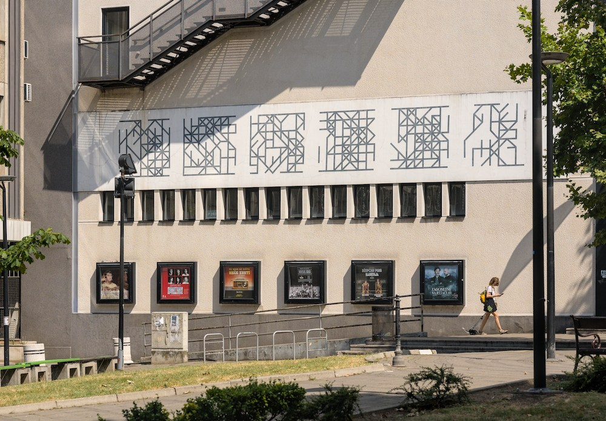

<!--  -->

# **Circuit** · Line pattern generator

## Play with it [at Pages](https://lstpxl.github.io/circuit/)

<!-- Playground at [https://lstpxl.github.io/circuit/](https://lstpxl.github.io/circuit/) -->

<!-- Inspired by Belgrade Club City Hall façade decor ([Google street view link](https://maps.app.goo.gl/B44u2bpYjzSQoiYg9)) -->

Project structure arranged according to FSD 2.1
